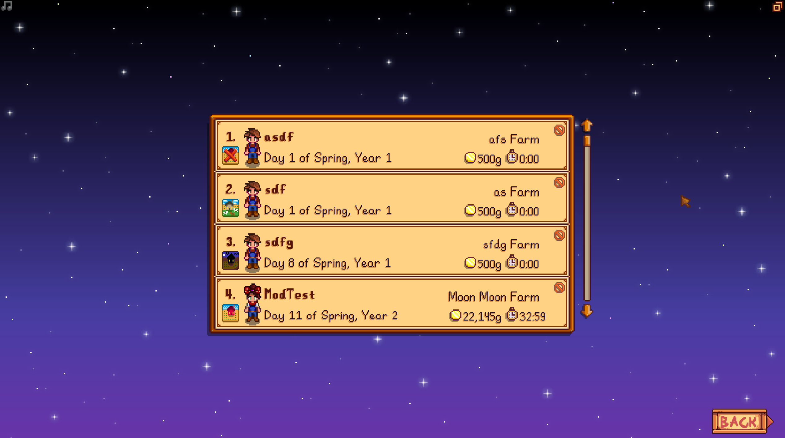

# FarmIconOnLoadScreen
This is an open source mod for Stardew Valley that displays the farm type on save files so that it is easier to know which farm is which.

## Requirements
- Stardew Valley 1.6 or later
- SMAPI 4.0.0 or later

## Installation
1. Install the latest version of [SMAPI](https://www.nexusmods.com/stardewvalley/mods/2400)
2. Download this mod and unzip it into StardewValley/Mods
3. Run the game using SMAPI

## Mirrors
[Nexus Mods Page](https://www.nexusmods.com/stardewvalley/mods/24344)

## Releases
### 1.2.2
  - Farm icon now updates if the farm type gets changed for an existing farm

### 1.2.1
  - Default button in GMCM now works properly

### 1.2.0
  ##### Features:
  - Farm icons now have tooltips when you hover over them
  ##### Bug Fixes:
  - Fixed issue with Meadowlands farm sometimes showing the wrong icon

### 1.1.0
- Now compatible with GenericModConfigMenu. The farm icons can now be default size or small size

### 1.0.1
- Fixed issue with farm type key being added to modData after every save instead of only once

### 1.0.0
- Initial upload

## Images
